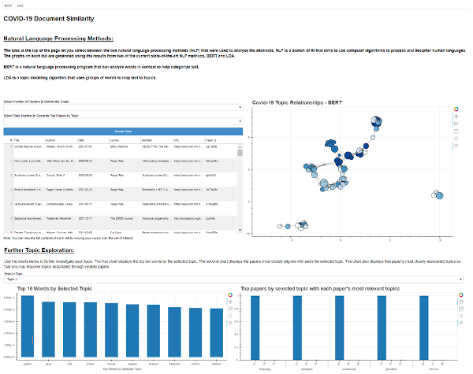
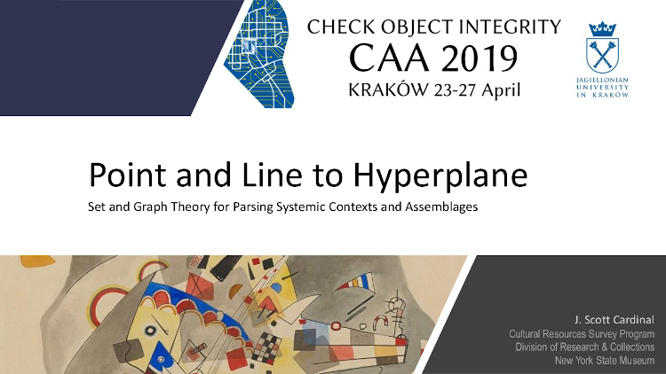

## My Portfolio

*Please note -- this site is under construction. Project pages will be
available soon.*

### Projects

#### [Machine Learning from "Scratch"](https://github.com/archaeojsc/ML_from_scratch)

Building machine learning methods from basic principles is a great way to
understand the mathematical and algorithmic intuitions behind the methods. Yes
`scikit-learn` and such are quicker and easier (and generally faster), but it's
always good to have an understanding of what is going on "under the hood".

This repository will be my examples of a variety of machine learning methods
and algorithms from "scratch" (i.e., using minimal or base/common libraries).
Check back, as I'll be expanding the list as I have time and as I'm exploring
more on my own.

Currently in progress:  

* $k$-means clustering

Coming soon:  

* Isomap

---

#### [Data Science in Archaeology](https://github.com/archaeojsc/Archaeo_DS)

A "day in the life" repository of using data science as an archaeologist...
samples from some of my work projects and experiments (mainly in R). Much of
this work revolves around simple ETL and EDA, summarization and descriptive
statistics, manipulating and summarizing spatial data, and a few more "advanced"
experiments with probability distribution modeling.

The code in this repository is very rough for now. I'll clean them up into
formal scripts as I have time.

---

#### Mapping linguistic psychometrics using NLP/NLU and graph community detection

Practicum project at GA Tech. My teammate and I applied natural language
processing, functional linguistics, and belief network analysis to detect
styles of political speech in a sample of social media posts. Using specific
parts of speech (i.e., pronouns) as psychometric indicators of discourse style,
we extracted linguistic markers for clusivity and affinity to identify
agonistic speech acts, conviction of belief, affiliation, and sentiment.

---

#### Semantic modeling of paper topics using topological overlap matrix (TOM) adjacency

Data and Visual Analytics (DVA) class project at GA Tech. My teammates and I
performed topic extraction and modeling of the semantic associations between
COVID-19 research abstracts as a searchable knowledge graph. Used a
transformer-based NLP topic extraction to form a network of topically related
research papers. Communities detected within that graph corresponded to a
biclustering of associations that simultaneously describe the similarity
between articles and topics, providing conceptually driven semantic search.

---

#### Spatio-temporal assemblage analysis of Fort Edward, New York  

Performed spatio-temporal analysis of artifact assemblages by adapting weighted
gene co-expression analysis (WGCNA) to the 3D locations of particular
diagnostic artifacts in order to reconstruct sequences of deposition across the
archaeological excavations.

---

### Publications

#### [Use, Purpose, and Function -- Letting the Artifacts Speak](https://www.mdpi.com/2571-9408/3/3/34)

An article (co-written with my wife) on archaeology, materiality, and theory of
artifact interpretation. This was our first joint publication (hopefully of
many). The theme is how we view, use, and interact with the material objects
around us and how we, as archaeologists, can interpret the artifacts of the
past through that lens.

---

#### [Sets, Graphs, and Things We Can See: A Formal Combinatorial Ontology for Empirical Intra-Site Analysis](https://journal.caa-international.org/articles/10.5334/jcaa.16/)

My first journal article. It's a deep-dive into the theory and methodology of
the data content of archaeological sites, along with a "primer" for
archaeologists on set and graph theory. The major finding was that
archaeological sites, assemblages, and contexts can be formalized as a system
of multisets.

---

### Presentations and Posters

#### [Why is a Raven like a Writing Desk?](pdf/CRIDC2020.pdf)

Poster presented at the 2021 virtual Career, Research, Innovation and
Development Conference (CRIDC) at GA Tech. There is much discussion about the
ethics and perceived bias in machine learning and artificial intelligence. We
took what we believe to be a somewhat different approach to the question -- do
we really know what we are training such models on? More specifically, are we
training on characteristics that are truly innate or merely on our own implicit
perceptions of associations?

---

#### [The Archaeology of Data](pdf/Cardinal_James_ArchaeologyOfData.pdf)

Poster presented at the 2020 virtual Career, Research, Innovation and
Development Conference (CRIDC) at GA Tech. When one thinks of archaeology, it
may suggest ancient civilizations, exotic art and objects in museums, or
portrayals in popular media such as “Indiana Jones” or “Lara Croft”. It might
be difficult to imagine a world any more different from the advanced
technologies and mathematics of data science. The actual practice of
archaeology, however, has many surprising parallels with modern data science –
stochastic and inhomogeneous spatial processes, classification and clustering
problems, social network and graph analysis, and managing unstructured data
ontologies. The true commonality, though, is that both are interested in
developing methodologies for converting data into information, with the goal of
transforming that information into knowledge.

---

#### [Point and Line to Hyperplane](https://youtu.be/sMj125KFeiM)

Recording of a paper I presented at the 2019 Computer Applications and
Quantitative Methods in Archaeology (CAA) international conference at
Jagiellonian University in Kraków, Poland. The topic was discussing the various
abstractions and formalization involved in parsing complex systems of sets in
an archaeological context, but I drift into a bit of information theory,
distance norms, and high dimensionality.

---

#### [Matrix in the Network](https://www.youtube.com/watch?v=WOTs4X5PiDw&feature=share)

Recording of a paper I presented at the 2018 Computer Applications and
Quantitative Methods in Archaeology (CAA) international conference at the
University of Tübingen, Germany. The topic was possible applications of set and
graph theory to the analysis of archaeological assemblages.

---

Page template forked from <a href="https://github.com/evanca/quick-portfolio">evanca</a>

<!-- Remove above link if you don't want to attibute -->
