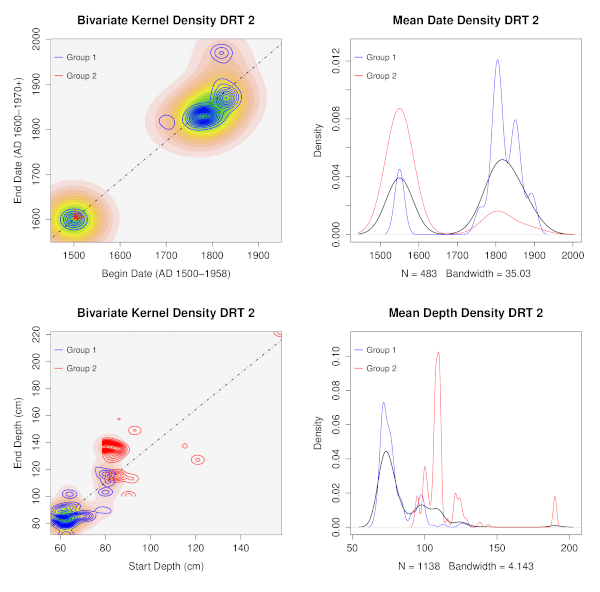

# Projects

## [Data Governance Analysis and Migration (ongoing)](https://github.com/archaeojsc/2022_Database_Migration)

Automation of database discovery, schema and ontology extraction, comparison,
and migration to a consolidated data management system using Python and pyODBC.
Program office has ~1k+ individual MS Access databases containing research
project data that has accumulated for 20+ years, but no data governance policies
for managing data assets. 

## [Bipartite Graph Association & Spatial Community Detection (ongoing)](https://github.com/archaeojsc/assemblage_network)

This will be the first of a short series of articles to demonstrate how I've
been using data, statistics, and such to gain insights into archaeological
research questions. In this installment, I discuss how archaeological sites map
to bipartite graphs and the initial setup and exploration of those two-mode
graphs with `R`.

## [Social Media Discourse Analysis (2021)](pdf/NST final report.pdf)

Practicum project at GA Tech. My teammate and I applied natural language
processing, functional linguistics, and belief network analysis to detect
styles of political speech in a sample of social media posts. Using specific
parts of speech (i.e., pronouns) as psychometric indicators of discourse style,
we extracted linguistic markers for clusivity and affinity to identify
agonistic speech acts, conviction of belief, affiliation, and sentiment.

Natural language processing (NLP), functional linguistics, and graph network
analysis to evaluate psycholinguistic indicators in political speech. Analyzed
collection of 15,000 tweets to learn patterns of sentiment and identify distinct
communities of discourse style. Found linguistic markers that consistently
identified influence and misinformation campaigns.

---

## [COVID-19 Research Abstract Topic Modeling and Query (2021) ](pdf/dnd_final_report.pdf)

Data and Visual Analytics (DVA) class project at GA Tech. My teammates and I
performed topic extraction and modeling of the semantic associations between
COVID-19 research abstracts as a searchable knowledge graph. Used a
transformer-based NLP topic extraction to form a network of topically related
research papers. Communities detected within that graph corresponded to a
biclustering of associations that simultaneously describe the similarity
between articles and topics, providing conceptually driven semantic search.

---

## Spatio-temporal assemblage analysis of Fort Edward, New York  

Performed spatio-temporal analysis of artifact assemblages by adapting weighted
gene co-expression analysis (WGCNA) to the 3D locations of particular
diagnostic artifacts in order to reconstruct sequences of deposition across the
archaeological excavations.

