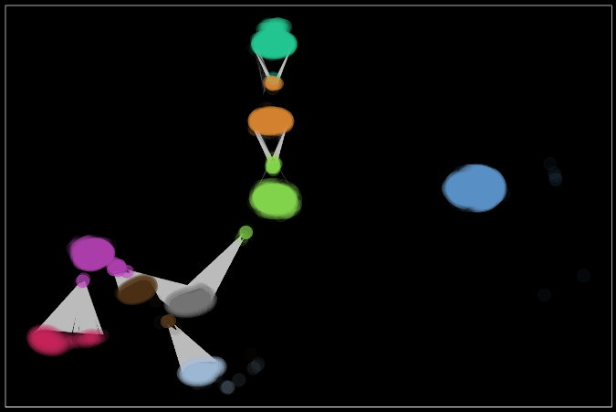

# Projects

## [Bipartite Graphs for Archaeological Assemblage Networks (Part I)](docs\assemblage_network_doc.html)

This will be the first of a short series of articles to demonstrate how I've
been using data, statistics, and such to gain insights into archaeological
research questions. In this installment, I discuss how archaeological sites map
to bipartite graphs and the initial setup and exploration of those tow-mode
graphs with `R`.

## Mapping linguistic psychometrics using NLP/NLU and graph community detection

Practicum project at GA Tech. My teammate and I applied natural language
processing, functional linguistics, and belief network analysis to detect
styles of political speech in a sample of social media posts. Using specific
parts of speech (i.e., pronouns) as psychometric indicators of discourse style,
we extracted linguistic markers for clusivity and affinity to identify
agonistic speech acts, conviction of belief, affiliation, and sentiment.

---

## Semantic modeling of paper topics using topological overlap matrix (TOM) adjacency

Data and Visual Analytics (DVA) class project at GA Tech. My teammates and I
performed topic extraction and modeling of the semantic associations between
COVID-19 research abstracts as a searchable knowledge graph. Used a
transformer-based NLP topic extraction to form a network of topically related
research papers. Communities detected within that graph corresponded to a
biclustering of associations that simultaneously describe the similarity
between articles and topics, providing conceptually driven semantic search.

---

## Spatio-temporal assemblage analysis of Fort Edward, New York  

Performed spatio-temporal analysis of artifact assemblages by adapting weighted
gene co-expression analysis (WGCNA) to the 3D locations of particular
diagnostic artifacts in order to reconstruct sequences of deposition across the
archaeological excavations.

